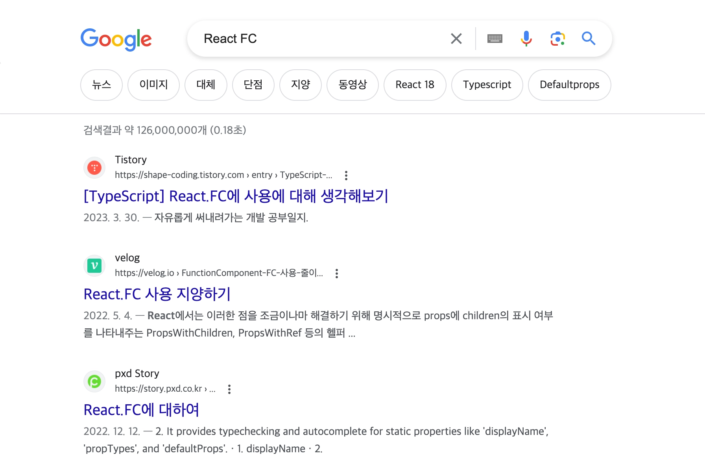

# 들어가며



React.FC (이하 FC) 관련하여 검색하면 나오는 글들이 대부분 FC의 사용을 지양해야 한다는 글이에요. 그 이유로는 FC는 기본적으로 props에 children을 포함하기 때문인데요. 현재는 children을 포함하고 있지 않습니다. 하지만 여전히 많은 자료가 FC를 지양해야 한다는 글이 있고, 옛날 글들이 상위에 노출 되고 있으며 업데이트 된 FC의 children은 `deprecated` 됐다는 정보를 포함하고 있지 않아 작성하게 됐어요.

해당 글에는 17 버전에는 왜 지양했으며 18 버전에 변경 된 사실 그리고 사용하면 어떤 이점이 있는지 알아보도록 하겠습니다.

# FC 사용을 왜 지양할까요

```typescript
// React 17의 React.FC 구조
type FC<P = {}> = FunctionComponent<P>;

interface FunctionComponent<P = {}> {
  (props: PropsWithChildren<P>, context?: any): ReactElement<any, any> | null;
  propTypes?: WeakValidationMap<P> | undefined;
  contextTypes?: ValidationMap<any> | undefined;
  defaultProps?: Partial<P> | undefined;
  displayName?: string | undefined;
}

type PropsWithChildren<P> = P & { children?: ReactNode | undefined };
```

React에서 18 버전 미만 버전에서는, FC는 `children`을 `옵셔널(선택적)` 속성으로 가지고 있었습니다. 이 때문에 `props`의 타입이 항상 명확하지 않았어요. 예를 들어, 만약 개발자가 `children`을 포함하지 않는 컴포넌트를 만들고자 했다면, FC를 사용할 경우 타입스크립트에서 어떤 에러도 발생시키지 않았습니다. 이런 상황은 타입스크립트에서 바람직하지 않은 패턴으로 여겨졌고, 이로 인해 많은 개발자들이 FC 사용을 지양하게 되었습니다. 검색하여 나오는 대부분의 글 또한 해당 문제를 꼬집고 있어요.

```typescript
type GreetingProps = {
  name: string
}

export const Greeting: FC<GreetingProps> = ({ name }) => {
  return <h1>Hello {name}</h1>
}

Greeting.defaultProps = {
  name: 'World',
}

const App = () => (
    <Greeting /> // !! 기본값이 정상적으로 지정되지 않음
)
```

FC의 문제점은 이것뿐만이 아니었습니다. FC에 포함된 `defaultProps`는 제대로 작동하지 않았습니다. 이 문제는 TypeScript와 React의 타입 정의 간의 상호 작용에서 발생한 것이었습니다.

# React 18의 FC

```typescript
// React 18의 React.FC 구조
type FC<P = {}> = FunctionComponent<P>;

interface FunctionComponent<P = {}> {
  (props: P, context?: any): ReactNode;
  propTypes?: WeakValidationMap<P> | undefined;
  contextTypes?: ValidationMap<any> | undefined;
  defaultProps?: Partial<P> | undefined;
  displayName?: string | undefined;
}

type WeakValidationMap<T> = {
  [K in keyof T]?: null extends T[K]
    ? Validator<T[K] | null | undefined>
    : undefined extends T[K]
      ? Validator<T[K] | null | undefined>
      : Validator<T[K]>;
};
```

React 18에서는 PropsWithChildren이 WeakValidationMap으로 변경되었으며, 이에 따라 FC에서 암시적으로 포함되던 children이 삭제되었습니다.

```typescript
// 함수 파라미터의 기본값 설정
type Props = {
  message: string;
};

const MyComponent: React.FC<Props> = ({ message = "기본 메시지" }) => {
  return <div>{message}</div>;
};
```

또한, React 18에서는 `defaultProps`의 문제도 해결되었습니다. 하지만 React 팀은 여전히 defaultProps를 사용하는 대신 함수 파라미터의 기본값을 사용하는 것을 권장합니다. 이 방식이 TypeScript와의 호환성이 더 좋고, 코드 명확성과 간결성 측면에서도 이점이 있기 때문이에요.

# FC를 사용하면 어떤 이점이 있을까요

이래저래 chdilren의 암시적 포함도 해결되고 defaultProps도 해결이 됐는데 어떤 걸 사용하지 모르시겠다고요? 사실 정답은 없습니다. 직접 타입을 지정해도 되고 변경된 FC를 사용해도 됩니다. 하지만 해당 글에서는 FC를 사용하면 이점이 뭔지 간단하게 소개하도록 하겠습니다.

- 명시적인 타입 정의: FC를 사용함으로써 컴포넌트가 React 함수형 컴포넌트인지 명확하게 알 수 있습니다.
- displayName: 해당 속성을 통해서 디버깅 할 때 컴포넌트 이름으로 식별할 수 있어요.

# React 17을 쓰고 있는데 변경됐다고요!?

맞습니다. React 17를 사용하시면서 FC를 적극적으로 사용했던 프로젝트라면 18로 업그레이드 할 때 점검하셔야 합니다.

> 이미 너무 많은 것을 FC를 사용해서 마이그레이션 시간이 오래걸려 안할까봐요..

그렇다면 버전 업그레이드를 하지 않으면 되는 것일까요? 이 또한 단순한 해답은 아닙니다. 버전 업그레이드에는 기능적인 개선뿐만 아니라 버그 수정 및 보안 픽스도 포함될 수 있습니다. 물론 이전 버전에도 마이너 패치를 통해 배포되지만, 새로운 기능이나 다양한 훅(hook)이 제공하는 개발자 경험(DX, Developer Experience)은 무시할 수 없다고 생각합니다.

매번 버전업을 할 때마다 업그레이드를 고려해야 하는 것은 아닙니다. 버전업을 통해 많은 편의성과 이점을 얻을 수 있지만, 변경되거나 삭제되는 사항들도 존재합니다. 업그레이드 전에는 반드시 변경점을 확인하고 점검해야 합니다.

# 마치며

리액트 17에서 왜 FC를 지양했는지를 알아보고 18버전에서 어떻게 변경되었는지, FC를 사용하면 좋은 점을 살펴보았습니다. 더하여 리액트 17를 사용하고 있는데 18로 업그레이드를 고려할때 마이그레이션 관점에서도 잠깐 얘기했습니다.

앞서 글에서 말했지만 정답은 없습니다. 진행하고 있는 혹은 본인의 코딩 스타일에 알맞은 방법을 채택하고 사용하는 것이라고 생각합니다. 하지만 이후에 또 다시 변경 되거나 삭제될 수 있다는 것을 염두하여 버전업 때마다 찾아보고 관심을 가져야한다고 생각해요.

# 참고

- https://react-typescript-cheatsheet.netlify.app/docs/basic/getting-started/function_components/
- https://github.com/DefinitelyTyped/DefinitelyTyped/pull/56210
- https://github.com/facebook/create-react-app/pull/8177
